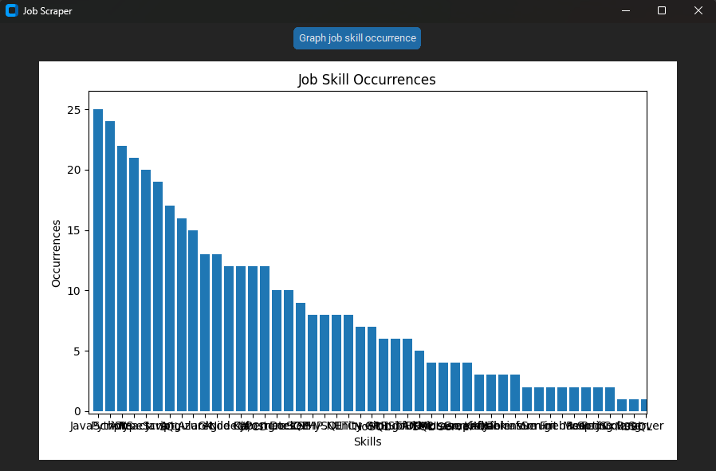
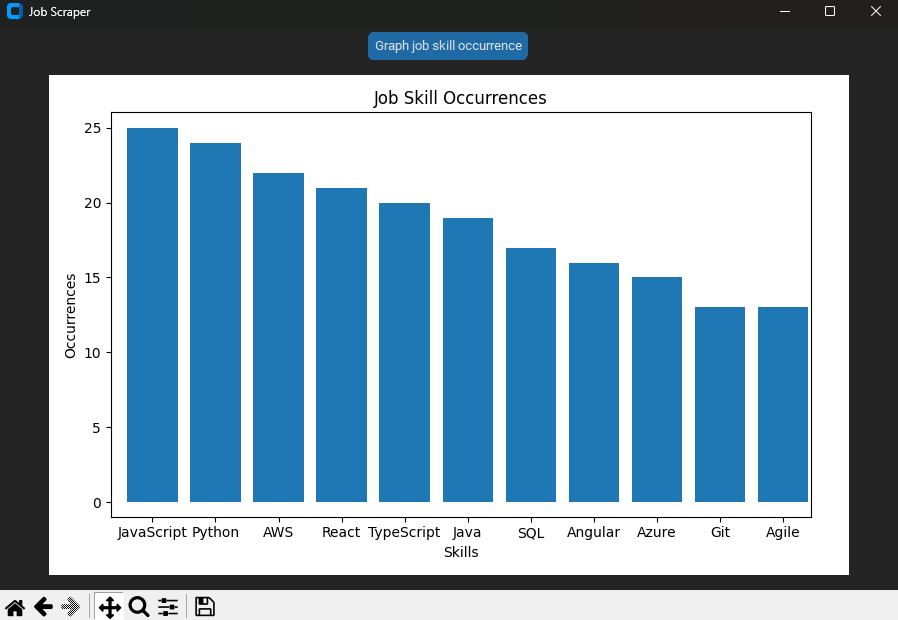

# Overview
A project designed to scrape a batch of job posts from 'Seek.com.au' job board to analyze job skill occurrence (currently targeting software engineer field).

# Current Developement Status
The program is running off customized spaCy NLP machine learning model to pick-up key software engineer skill terms only.

Currently, the accuracy rate is at 60%. Further improvement to the model prediction is undertaken.

Each execution of the program will scrape 100 job posts currently advertised on Seek.com.au website (promoted and non-promoted) and evaluate the occurence trend for each skills in descending order.

# Market Trend Demo

Overall View:

Detail View:

# Installation
The program hasn't been packaged to be ready-to-use after download yet! Currently compatible with Windows OS only. 

Python SDK is required to be installed to run the program via any terminal.

Executing the following steps to setup the program to run:

Download the repoitory and run the following command to run the program:

py .\Display.py 

in root directory
